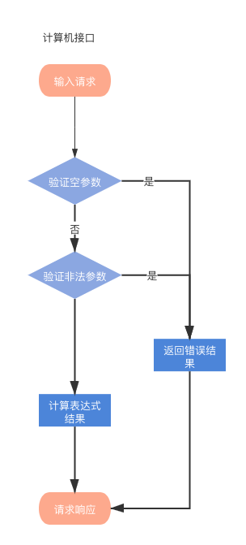

## 1.整体框架

本服务提供http服务，通过使用mvc模式拆分项目。

## 2.目录结构

```
├── app
│   ├── http
│   │   └── httpServer.go #http服务
│   └── main.go #程序入口
├── config #配文件
│   └── app.ini
├── go.mod
├── internal
│   ├── ctrl #控制器层
│   │   └── CalculateController.go
│   ├── handler #handler层
│   │   ├── CalculatoHandler.go
│   │   └── CalculatoHandler_test.go
│   ├── model #模型层
│   │   ├── Result.go
│   │   └── Stack.go
│   ├── router #路由层
│   │   └── CalculatoRouter.go
│   ├── service #service层
│   │   └── ValStrService.go
│   └── utils #工具层
│       └── IniUtils.go
├── locust #压力测试
│   ├── LocustFile.py
│   └── report_1627634419.714995.html
└── readme.md
```


## 3.代码逻辑分层

| 层        | 文件夹                  | 主要职责                             | 调用关系                  | 其他说明         |
| --------- | ----------------------- | ------------------------------------ | ------------------------- | ---------------- |
| 应用层    | /app/http/httpServer.go | 进程启动，server初始化               | 调用路由层                | 不可同层相互调用 |
| 路由层    | /internal/router        | 路由转发，http的path                 | 调用控制层，被应用层调用  | 不可同层相互调用 |
| 控制层    | /internal/ctrl          | 请求参数验证、处理请求后构造回复消息 | 调用handler，被路由层调用 | 不可同层相互调用 |
| handler层 | /internal/handler       | 处理具体业务逻辑                     | 调用模型层，被控制层调用  | 不可同层相互调用 |
| 模型层    | /internal/model         | 数据模型                             | 被业务逻辑层调用          | 不可同层相互调用 |
| service层 | /internal/service       | 通用业务逻辑                         | 被handler调用             | 不可同层相互调用 |
| utils层   | /internal/utils         | 工具层                               | 被各层调用                | 不可同层相互调用 |
| config    | /config                 | 存放配置文件和日志文件               |                           |                  |

## 4.存储设计

栈设计

| 内容         | 数据库 | field | 类型  |
| ------------ | ------ | ----- | ----- |
| 栈顶         | 无     | Top   | int   |
| 模拟栈的数组 | 无     | Arr   | slice |

返回结果设计

| 内容     | 数据库 | field | 类型        |
| -------- | ------ | ----- | ----------- |
| 状态码   | 无     | Code  | string      |
| 返回消息 | 无     | Msg   | string      |
| 返回结果 | 无     | Data  | interface{} |


## 5.接口设计

### 5.1第一个接口 - go实现

#### 接口功能

根据输入表达式计算出正确的结果

#### HTTP请求方式

POST

127.0.0.1:8000/calculator

#### 请求参数

| 参数         | 必选 | 类型 | 说明         |
| ------------ | ---- | ---- | ------------ |
| calculatoStr | true | text | 表达式字符串 |

```json
{
  "calculatoStr":"4+8-9*33+2"
 
}
```


#### 请求响应

```json
{
    "code": 200,
    "data": -283,
    "message": "OK"
}
```

#### 响应状态码

| 状态码 | 说明                                   |
| ------ | -------------------------------------- |
| 201    | 开头和结尾不允许使用操作符，不符合规范 |
| 202    | 操作符连续，不符合规范                 |
| 203    | 存在非法字符，请重新输入               |
| 204    | 请输入表达式                           |
| 200    | 成功                                   |

#### 响应消息说明

| 字段    | 说明       |
| ------- | ---------- |
| code    | 响应状态码 |
| data    | 响应数据   |
| message | 响应消息   |


## 6.第三方库

### gin

```
用于http服务创建代码  https://github.com/gin-gonic/gin
```

## 7.如何编译执行

在app文件目录下编译main.go文件后生成可执行文件main，将可执行文件文件放到根目录下进行执行。

在项目执行可执行文件的执行命令

```sh
./main
```

在app目录下执行main.go时需要设置working directory为项目根路径


在单元测试代码目录下执行go test时设置working directory为项目根路径


## 8.todo

1.后续的项目结构优化。

## 流程图



